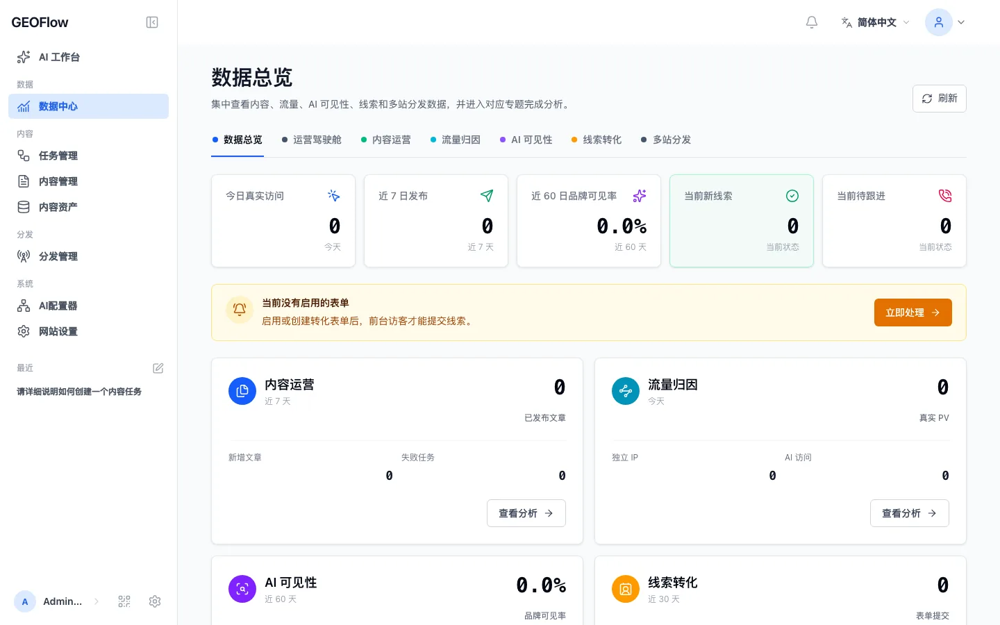
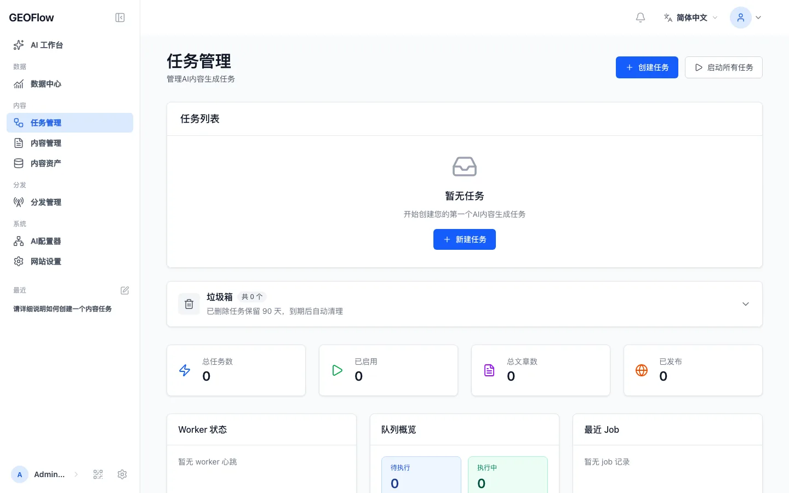
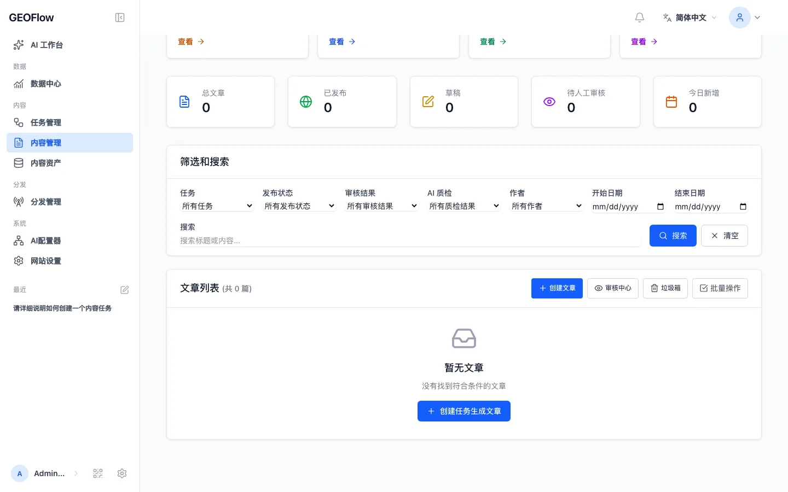
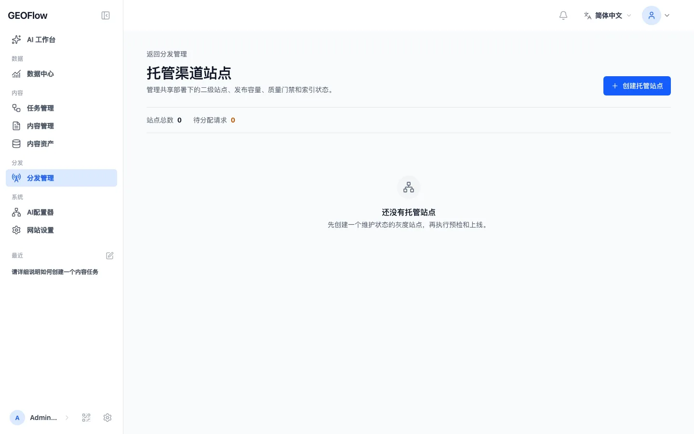

# GEOFlow

> Languages: [简体中文](README.md) | [English](docs/readme/README_en.md) | [日本語](docs/readme/README_ja.md) | [Español](docs/readme/README_es.md) | [Русский](docs/readme/README_ru.md) | [Português (BR)](docs/readme/README_pt_BR.md)

> GEOFlow 是一套面向 GEO（生成式引擎优化）的开源智能内容工程与多站点分发系统。它把系统知识、素材与提示词、AI 生成、文章质检、审核发布、浏览器运营协作、托管渠道站点和数据分析串联成一条可持续运营的工作链路，帮助团队把可信资料沉淀为可管理、可发布、可追踪、可同步到多端的 GEO 内容资产。

[](https://www.php.net/)
[](https://github.com/yaojingang/GEOFlow/actions/workflows/ci.yml)
[](https://www.postgresql.org/)
[](https://docs.docker.com/compose/)
[](LICENSE)
[](https://github.com/yaojingang/GEOFlow/stargazers)
[](https://github.com/yaojingang/GEOFlow/network/members)
[](https://github.com/yaojingang/GEOFlow/issues)

GEOFlow 以 [Apache License 2.0](LICENSE) 开源发布。你可以自由使用、复制、修改和分发本项目，包括商业使用；请保留版权声明和许可证文本，并遵守 Apache-2.0 的专利授权、商标与免责声明条款。

### 匿名使用统计

GEOFlow 提供默认关闭的匿名使用统计，用于了解项目部署量、后台日活和版本分布。部署方同时启用开关并配置 HTTPS 采集地址后，已登录后台页面每天最多发送一次活跃事件，内容限定为随机实例 ID、管理员不可逆摘要、GEOFlow 版本和事件类型。

域名、页面路径、管理员账号、邮箱、文章内容、Cookie、APP_KEY 和业务密钥不会进入上报载荷。监控地址为空时不会产生请求；默认配置为：

```dotenv
GEOFLOW_TELEMETRY_ENABLED=false
```

---

## ✨ 你可以用它做什么

| 特性 | 说明 |
|------|------|
| 🤖 多模型内容生成 | 兼容 OpenAI 风格接口和 Gemini 原生接口，支持 chat / embedding 模型、Provider URL 自动适配、智能模型切换、失败重试和调用统计 |
| 🧠 知识库与 RAG | 知识库上传后支持结构化规则切片、可选 LLM 语义规划和稳定回退；配置 embedding 模型后写入向量，在文章生成时召回相关资料 |
| 🧭 后台图文帮助 | 内置系统知识库、权限过滤后的功能入口、流式问答和 24 张脱敏后台截图，帮助管理员定位功能与排查问题 |
| 🛡️ 文章 AI 质检 | 按知识证据、广告规则和发布语境检查文章，输出分项评分、问题定位、法规依据、修改建议和可审计人工放行 |
| 🗂 素材与提示词体系 | 标题库、关键词库、图片库、作者库、知识库、正文提示词、特殊提示词集中管理 |
| 📦 任务自动化 | 支持任务创建、生成数量、草稿池、审核开关、发布节奏、队列执行、失败重试、发布范围控制和任务文章筛选 |
| 📋 审核与文章管理 | 草稿、审核、发布、回收站、作者、分类、SEO 字段和任务来源统一管理 |
| ✍️ 人工发布工作台 | 将已审核文章或评论文案编排为人工发布工单，支持身份、账号、执行人、计划时间、风险提示、重复提醒、发布回执和 CSV 导出 |
| 🌐 Chrome 运营助手与 PWA | 通过设备配对领取人工发布工单、填充待审核草稿并回传凭证；后台可安装为独立 PWA 工作台 |
| 📡 多站点分发管理 | 支持 GEOFlow Agent、WordPress REST 与通用 HTTP API 渠道、密钥管理、目标站点包、静态模式、伪静态规则、远端文章编辑/删除和队列日志 |
| 🧾 目标站点包 | 为每个渠道生成预配置 PHP Agent 包，内置首页、详情页、静态资源、sitemap、`llms.txt` / TXT 地图和 Schema |
| 📊 数据分析 | 集中展示系统总览、单站内容运营、多站分发、访问日志、Top 内容、AI 爬虫识别和趋势图 |
| 🔍 SEO 与 LLM 抓取友好输出 | 文章 SEO 元信息、Open Graph、Schema、GFM Markdown、独立 CSS、图片同步、sitemap 和 TXT 地图 |
| 🎨 前台与主题 | 默认主题、主题包、预览路径、后台主题切换；GEOFlow Agent 渠道可同步站点标题、版权、主题和分类设置 |
| 🌍 后台多语言 | 后台支持中文、英文、日语、西班牙语、俄语、葡萄牙语（巴西）切换，并覆盖 Admin UI V3 模块 |
| 🔔 版本提醒 | 后台可按 `version.json` 检查 GitHub 新版本，并在有新版本时提醒管理员 |
| ♻️ 独立更新与恢复 | GEOFlow Updater 通过签名安装包和本地 Unix socket 承担网站更新、完整备份、环境验收与恢复点回滚 |
| 🐳 可直接部署 | **Docker Compose** 一键拉起 PostgreSQL（pgvector）、Redis、应用、队列、调度、Reverb 和生产 Nginx/php-fpm |
| 🧭 GEOFlow Agent Skill | 仓库内置统一的 `$geoflow` Skill，覆盖产品开发、后台运营、网站前台、主题模板、渠道站点和旧版迁移 |

---

## 🧭 GEOFlow Agent Skill

仓库在 [`.agents/skills/geoflow`](.agents/skills/geoflow/) 内提供统一的 GEOFlow Skill。支持 Agent Skills 的工具打开本项目后可以直接发现它；在 Codex 中可通过 `$geoflow` 调用。

这个统一入口覆盖五种工作模式：

| 模式 | 适用范围 |
|------|----------|
| `development` | Laravel 后端、管理后台、API、CLI、队列、迁移和测试 |
| `operations` | 通过受支持的 CLI、API v1 或登录后的管理界面执行系统操作 |
| `public_frontend` | 默认网站、Blade 主题、首页模块、线索表单和前台页面 |
| `channel_frontend` | GEOFlow Agent 目标站点包、渠道能力检查、同步预览和渠道前台设置 |
| `legacy_migration` | 旧版根目录 PHP 模板、历史包体和旧 Skill 标识迁移 |

它统一替代 `yao-geoflow-cli`、`yao-geoflow-design` 和 `yao-geoflow-template`。如需安装或升级为 Codex 全局 Skill，可在克隆仓库后执行：

```bash
bash .agents/skills/geoflow/scripts/install_codex_skill.sh
```

安装器只复制公开清单中的文件，校验暂存包，将当前 `geoflow` 和三个旧 Skill 移到唯一的 `~/.codex/skill-backups/geoflow-<时间戳>.<后缀>/`，随后在同一文件系统内切换新版本。完成后重启 Codex。依赖矩阵、回滚命令和平台边界见 [Skill 安装说明](.agents/skills/geoflow/README.md#installation)。

---

## GEOFlow CLI 0.2.0

仓库内置 `bin/geoflow`，用于通过 API v1 管理目录、任务、执行记录、素材和文章。CLI 支持安全配置、登录、JSON 文件或 stdin、删除确认和结构化错误提示。正式支持 macOS、Linux 和 WSL；原生 Windows 的配置文件 ACL 需要手动确认。

[CLI 中文完整文档](docs/GEOFLOW_CLI.md) | [CLI English guide](docs/GEOFLOW_CLI_en.md)

---

## 🖼 界面预览

<table>
  <tr>
    <td width="50%"><br /><sub>图文帮助工作台</sub></td>
    <td width="50%"><br /><sub>数据中心</sub></td>
  </tr>
  <tr>
    <td width="50%"><br /><sub>任务管理</sub></td>
    <td width="50%"><br /><sub>文章 AI 质检</sub></td>
  </tr>
  <tr>
    <td width="50%"><br /><sub>托管渠道站点</sub></td>
    <td width="50%"><br /><sub>人工发布工作台</sub></td>
  </tr>
</table>

上述页面来自 v3.0 内置的脱敏帮助素材，覆盖图文问答、数据分析、任务调度、文章质检、托管站点与人工发布等主链路；更多后台说明见 `docs/`。

---

## 🆕 新版本重点

GEOFlow 3.0 是一次覆盖后台、AI、分发和运营协作的主版本升级：

- **Admin UI V3 全面统一**：后台页面共享新的侧栏、顶栏、导航和交互规范，补充最近访问、侧栏宽度调节、移动端布局、无障碍状态和本地静态资源。
- **AI 工作台升级为图文帮助助手**：内置系统知识库覆盖 15 个后台主题，配套 24 张脱敏截图和 72 条固定评测；助手通过 SSE 流式回答使用问题，并只展示当前管理员有权访问的功能入口。旧版 Run、Plan、Approval、Capability 与 Trace 工作流停止接收新请求，历史数据继续保留。
- **文章 AI 质检进入发布门禁**：系统结合任务知识、版本化广告规则和发布语境输出分项评分、证据、原文定位、法规依据与修改建议；待复核、阻断、异常和过期结果会留在草稿阶段。
- **托管渠道站点进入完整闭环**：支持子域名分配、生命周期管理、文章分配、发布配额、失败冷却、技术预检、缓存失效和状态对账，并加入主站、托管根域与可信代理边界。
- **人工发布连接 Chrome 运营助手**：浏览器扩展使用设备配对和最小权限 Token 领取工作单、维持心跳、校验账号、填充知乎纯文字回答草稿并回传执行凭证，最终发布仍由用户确认。
- **后台支持 PWA 安装**：管理员可以把工作台安装为独立应用，离线壳层、图标和更新策略由站内资源统一提供。
- **内容运营工具补齐长任务场景**：标题库支持最高 10 万条的分批 AI 生成、进度恢复和取消；任务回收站保留 90 天审计记录，文章列表支持批量 Markdown 导出。
- **任务和模型配置更稳**：任务启动前检查标题库容量与冲突，AI 模型配置补充真实流式检测、普通文本降级、故障转移和更完整的就绪状态。
- **API 与 CLI 覆盖日常运营**：API v1 和 `bin/geoflow` 覆盖目录、任务、执行记录、素材、文章与浏览器运营协议，支持结构化输入输出和安全确认。
- **独立更新工具接管高风险操作**：网站通过固定类型的本地 Unix socket 请求更新、完整备份、环境验收与恢复点回滚，敏感操作要求管理员密码和 6 位验证器授权码，旧更新记录继续提供只读审计。
- **安装与部署边界重新整理**：全新安装默认使用干净数据，不自动导入演示文章；升级需要执行迁移、重建前端并重启运行进程，随后安装并验证 [GEOFlow Updater](https://github.com/yaojingang/geoflow-updater)。托管站点需完成泛 DNS、通配符 TLS、可信代理与 Nginx 配置后再开启。

---

## 🏗 运行结构

```
后台管理页面
    ↓
AI 配置 / 素材库 / 提示词 / 任务配置
    ↓
调度器 / 队列 / Worker 执行 AI 生成
    ↓
草稿 / 审核 / 发布
    ↓
本地前台文章与 SEO 页面
    ↓
分发队列 / 目标站点 Agent
    ↓
远端静态首页、详情页、sitemap、TXT 地图与 llms.txt
```

---

## 🧱 系统架构

| 层级 | 说明 |
|------|------|
| Web / Admin | **Laravel** 路由与控制器；前台文章站点、**Blade** 后台、数据分析、分发管理、素材与任务入口 |
| API / Agent | 本地 API 与目标站点 PHP Agent；负责分发健康检查、文章接收、远端设置同步和静态文件生成 |
| Scheduler / Queue / Reverb | **Laravel Scheduler** 扫描与入队；**`queue:work` / Horizon** 消费生成与分发任务；**Reverb** 按需启用 |
| Domain & Jobs | `app/Services`、`app/Jobs`、`app/Http/Controllers` 等承载 AI 生成、RAG、发布、分发和日志分析规则 |
| Persistence | **PostgreSQL**（推荐 **pgvector** 镜像与线上实例一致）+ **Redis**（队列/缓存等）+ 目标站点本地 JSON/静态文件 |

核心链路：

1. 在后台配置模型、提示词与素材库
2. 准备知识库、标题库、关键词库、图片库和作者库，按需要选择知识库切片策略
3. 创建任务并进入调度与队列
4. Worker（队列进程）调用模型生成正文与元数据
5. 文章进入草稿、审核、发布链路
6. 本地前台输出文章与 SEO 页面
7. 如选择分发渠道，文章进入分发队列并同步到 GEOFlow Agent 或 WordPress 目标站点
8. 数据分析页持续查看内容生产、分发状态、访问日志和 AI 爬虫趋势

---

## ✍️ 人工发布工作台

后台「人工发布」用于管理需要运营人员在外部平台手动完成的发帖与评论任务：

1. 超级管理员在「身份与账号」中建立发布身份和平台账号引用。
2. 从已审核文章创建发帖工单，或为公开目标地址创建评论工单。
3. 设置最终文案、执行人和计划时间，将工单流转到待执行状态。
4. 执行人复制内容，在外部平台发布并回填实际发布地址和结果备注。
5. 管理员通过筛选、状态统计、重复提醒和 CSV 导出持续跟踪执行情况。

可选的 Chrome 运营助手支持领取工作单、打开目标页、校验指定账号、复制内容，以及在知乎问题页填充纯文字回答草稿。用户检查草稿并亲自点击平台的最终发布按钮，扩展随后回传结果 URL 和执行凭证。安装、配对与故障恢复说明见 [`docs/browser-operations-runbook.md`](docs/browser-operations-runbook.md)。

工作台和 Chrome 扩展均不保存平台密码、Cookie、Token 或 OAuth 凭证。发布内容、来源文章和身份披露文案按工单保存快照；普通管理员只能查看和处理分配给自己的工单。

---

## ⚡ 后台三步上手

登录后台后，建议按仪表盘里的「快速开始」完成第一轮验证：

1. **配置 API**：至少添加一个可用 chat 模型；如果需要知识库 RAG 召回，再添加一个 embedding 模型，并选择适合的知识库切片策略。
2. **配置素材库**：准备知识库、标题库、关键词库、图片库和作者。知识库建议先用真实、可验证的业务资料。
3. **新建任务**：选择标题库、素材、模型、生成数量、发布频率和发布范围，先让文章进入草稿或审核流程，再逐步开启自动发布与多站点分发。

---

## 🎯 适用场景与目标收益

GEOFlow 适合这些真实且可落地的场景：

- **独立 GEO 官网**
  把官网内容、产品资料、FAQ、案例和品牌知识组织成一个可持续更新的内容系统。目标是提升 AI 搜索可见度、品牌信源覆盖和内容运营效率，而不是堆砌低质量页面。
- **官网中的 GEO 子频道**
  在现有官网下搭建一个独立的资讯、知识或解决方案频道。目标是让品牌内容更结构化、更适合搜索引用，也方便不同团队协同更新。
- **独立 GEO 信源站点**
  面向某个行业、主题或问题域，持续沉淀高质量文章、榜单、解读、指南和资料。目标是构建稳定可信的外部内容资产，而不是做信息污染。
- **GEO 内容管理系统**
  作为内部内容生产后台，统一管理模型、素材、标题、图片、知识库、审核和发布。目标是提升团队提效、降低重复劳动、减少分散工具切换。
- **GEO 多站点 / 多栏目部署**
  用同一套系统管理多个站点、多个栏目或多个主题模板。目标是让内容生产、模板切换、分发和维护更标准化。
- **自动化信源管理与内容分发**
  对知识库、专题内容、资讯更新和内容分发流程进行工程化管理。目标是让真正有价值的信息更稳定地被用户和 AI 理解、引用和检索。

这套系统的收益，应该建立在**真实、优质、持续维护的知识库**之上。
我们不鼓励利用系统制造信息噪音、批量污染互联网或堆积虚假内容。GEOFlow 的本质是帮助团队更高效地管理、生产和分发可信内容，提升 AI 营销效率和 GEO 运营效率，而不是替代事实、替代判断或替代内容质量本身。

---

## 🧭 场景对应的部署与使用方式

不同场景下，建议这样使用 GEOFlow：

- **作为独立 GEO 官网运行**
  直接部署完整前台与后台，围绕官网栏目、产品页延展内容、FAQ、案例和专题进行运营。适合希望把官网做成 AI 搜索友好型内容资产的团队。
- **作为官网中的 GEO 子频道运行**
  将 GEOFlow 作为一个相对独立的内容频道部署，再通过导航、子域名或目录与主站打通。适合不想重构主站、但需要快速上线内容频道的团队。
- **作为 GEO 信源站运行**
  单独维护一个面向特定主题的内容站点，把知识库和资料建设放在首位，再通过任务系统做稳定更新。适合想做行业型、专题型或问题导向型内容资产的团队。
- **作为内部 GEO 内容管理后台运行**
  把前台弱化，重点使用后台的模型配置、素材库、任务调度、审核发布与 API 能力。适合内容团队、增长团队、品牌团队做内部生产系统。
- **作为多站点 / 多频道系统运行**
  使用不同模板、栏目、域名或部署实例，管理多个内容出口。适合需要同时维护多个品牌频道、多个主题站或多个实验站点的团队。
- **作为自动化信源管理系统运行**
  重点建设知识库、标题库、图片库和提示词体系，把系统当作一个内容工程与分发操作台。适合希望长期沉淀可信知识资产、再逐步扩展自动化能力的团队。

建议的使用顺序是：

1. 先确定真实的业务目标和目标读者
2. 先建设知识库，再建设自动化流程
3. 先确保内容真实、可核验、可维护
4. 再用模型、任务和模板能力去提效

如果知识库本身不真实、不完整、不稳定，再强的自动化也只会放大噪音。
所以在 GEOFlow 里，**知识库建设应该始终排在最前面**。

---

## 🚀 快速开始

### 方式一：Docker（开发 / 演示）

```bash
# 1. 克隆仓库
git clone https://github.com/yaojingang/GEOFlow.git
cd GEOFlow

# 2. 复制环境变量
cp .env.example .env

# 3. 按需编辑 .env（数据库、Redis、APP_URL、ADMIN_BASE_PATH、REVERB_* 等）
vi .env

# 4. 构建并启动（含 postgres、redis、init、app、三类 queue、scheduler、reverb）
docker compose build
docker compose up -d --remove-orphans
```

`--remove-orphans` 会清理同一 Compose 项目中已从当前配置移除的旧服务容器，默认保留数据卷。请始终在仓库根目录使用同一组 Compose 文件和项目名执行该命令。

- 前台默认访问：`http://localhost:18080`（端口由环境变量 **`APP_PORT`** 控制，默认 `18080`）
- 后台登录：`http://localhost:18080/geo_admin/login`（前缀由 **`ADMIN_BASE_PATH`** 控制，默认 `geo_admin`）

首次启动会运行 **`init`** 容器：在数据库就绪后执行首次迁移与种子（默认管理员见下文「默认管理员」）。

### 方式一补充：Docker（生产）

生产环境建议使用 **`docker-compose.prod.yml`**，改为 **`Nginx + php-fpm`**，而不是 `php artisan serve`。

全新空库首次部署时，如果希望在常见云服务器上自动完成环境自检、Docker 检测、`.env.prod` 生成、容器部署和部署后健康检查，可以使用参考部署脚本：

```bash
curl -fsSL https://raw.githubusercontent.com/yaojingang/GEOFlow/main/deploy-scripts/geoflow-docker-deploy.sh -o geoflow-docker-deploy.sh
bash geoflow-docker-deploy.sh
```

脚本说明见 [`deploy-scripts/README.md`](deploy-scripts/README.md)。

```bash
cp .env.prod.example .env.prod
vi .env.prod

docker compose --env-file .env.prod -f docker-compose.prod.yml build
docker compose --env-file .env.prod -f docker-compose.prod.yml up -d postgres redis
docker compose --env-file .env.prod -f docker-compose.prod.yml up -d init
docker compose --env-file .env.prod -f docker-compose.prod.yml up -d --remove-orphans app web queue knowledge-queue scheduler reverb
```

- 前台 / 后台统一经 `web`（Nginx）访问
- PHP 由 `app`（php-fpm）解析
- `APP_URL` 使用 `http://` 时设置 `SESSION_SECURE_COOKIE=false`；启用 HTTPS 后设置为 `true`
- **首次安装**：生产 `init` 服务会先执行迁移，再运行 `php artisan geoflow:install`。该流程仅用于全新空库；已有数据或迁移历史的实例必须执行 `docs/deployment/DEPLOYMENT.md` 3.1 节的停机排空升级协议。
- 详细说明见 `docs/deployment/DEPLOYMENT.md`

### 方式二：本地 PHP 服务器

**前置要求：** PHP **8.3+**，启用 `pdo_pgsql`、`redis` 等 Laravel 常用扩展；本机已安装 **PostgreSQL** 与 **Redis**；已安装 **Composer 2.x**。

```bash
# 1. 克隆仓库
git clone https://github.com/yaojingang/GEOFlow.git
cd GEOFlow

# 2. 环境与依赖
cp .env.example .env
# 编辑 .env：将 DB_HOST/DB_* 指向本机 Postgres，REDIS_* 指向本机 Redis，QUEUE_CONNECTION=redis 等

composer install --no-interaction --prefer-dist
php artisan key:generate

# 3. 数据库与存储
GEOFLOW_SECURITY_FRESH_INSTALL_CONFIRMED=true php artisan migrate --force
php artisan geoflow:install                                            # 首次空库安装
php artisan storage:link

# 4. 开发用 HTTP（仅本地调试；生产请用 Nginx + PHP-FPM，站点根目录 public/）
php artisan serve --host=127.0.0.1 --port=8080
```

另开终端启动常驻进程（每条 `queue:work` 需要独立终端或进程托管）：

```bash
php -d memory_limit=256M artisan queue:work redis --queue=system-updates,geoflow,distribution,theme-replication,default --sleep=1 --tries=1 --timeout=930 --memory=128 --max-jobs=100 --max-time=3600
php -d memory_limit=160M artisan queue:work redis --queue=knowledge --sleep=1 --tries=1 --timeout=210 --memory=128 --max-jobs=20 --max-time=1800
php artisan schedule:work
php artisan reverb:start
```

- 后台：`http://127.0.0.1:8080/geo_admin/login`（若修改了 `ADMIN_BASE_PATH` 请替换路径）
- 生产可用 `php artisan horizon` 替代 `queue:work`（需按项目配置托管进程）

---

## 环境要求（部署检查清单）

| 组件 | 说明 |
|------|------|
| PHP | **8.3+**（Docker 镜像可为 8.4） |
| 扩展 | Laravel 常规扩展；PostgreSQL 需 `pdo_pgsql`；Redis 队列需 `redis` |
| Composer | 2.x |
| 数据库 | **PostgreSQL**（推荐 **pgvector**，与 `docker-compose.yml` 中镜像一致） |
| Redis | 队列、缓存等（本地极简调试可将 `QUEUE_CONNECTION` 改为 `sync`，生产不推荐） |

---

## 源码部署补充说明

**目录权限（Linux / macOS 常见）：**

```bash
chmod -R ug+rwx storage bootstrap/cache
```

**默认管理员（首次空库执行 `php artisan geoflow:install` 后，以 `Database\\Seeders\\AdminUserSeeder` 为准）：**

| 字段 | 值 |
|------|-----|
| 用户名 | `GEOFLOW_ADMIN_USERNAME`，默认 `admin` |
| 密码 | 本地开发默认 `password`；生产环境请设置 `GEOFLOW_ADMIN_PASSWORD`。若生产环境留空且账号尚不存在，首次安装会生成一次性随机密码并输出到初始化日志 |

补充规则：`geoflow:install` 只在空库首次安装时执行安装填充；如果检测到线上已有业务数据但没有初始化标记，它只写入标记并跳过填充。`AdminUserSeeder` 本身仍保持幂等：目标用户名已存在时不会覆盖用户名、邮箱或密码。

### 管理员登录失败锁定与手动解锁

- 后台账号连续登录失败 **5 次** 会自动锁定（`status=locked`）。
- 被锁定账号无法继续登录，需管理员手动解锁。
- 解锁命令：

```bash
php artisan geoflow:admin-unlock USERNAME
```

例如：

```bash
php artisan geoflow:admin-unlock admin
```

**生产环境 Web：** 使用 Nginx / Apache + **PHP-FPM**，网站根目录指向项目 **`public/`**，勿将仓库根目录直接暴露为文档根。

---

## Docker 部署补充说明

### 开发 Compose 服务一览

| 服务 | 作用 |
|------|------|
| `postgres` | PostgreSQL 16 + pgvector |
| `redis` | Redis 7 |
| `assets` | 一次性安装前端依赖并执行 Vite 资源构建 |
| `init` | 一次性初始化（`restart: "no"`） |
| `app` | 内网运行 `php artisan serve`，不直接暴露宿主机端口 |
| `web` | Nginx 统一入口，映射 **`127.0.0.1:${APP_PORT:-18080}:80`** |
| `queue` | 文章生成、分发、主题复刻与默认队列 |
| `knowledge-queue` | 知识库解析与向量化队列，独立内存上限 |
| `scheduler` | `schedule:work` |
| `reverb` | 内网 WebSocket 服务，由 Nginx 通过同源路径 **`/reverb`** 转发 |

宿主机仅绑定 **127.0.0.1** 暴露数据库 / Redis 端口时，见 `docker-compose.yml` 中的 `DB_EXPOSE_PORT`、`REDIS_EXPOSE_PORT`。

### 入口脚本（`docker/entrypoint.sh`）常用变量

| 变量 | 默认 | 含义 |
|------|------|------|
| `COMPOSER_ON_START` | `true` | 容器启动时执行 `composer install` |
| `AUTO_MIGRATE` | `true` | 启动时执行 `php artisan migrate --force`；已有部署遇到安全迁移时仍须先完成停机排空协议 |
| `AUTO_INIT_ONCE` | 仅 `init` 为 `true` | 执行 `migrate` + `geoflow:install`，由安装命令判断是否空库 |
| `AUTO_INSTALL_ONCE` | `false` | 已完成迁移后单独执行一次 `geoflow:install`，常驻服务不建议开启 |

开发 Compose 的队列、调度和 Reverb 服务会显式关闭 `COMPOSER_ON_START` 与 `AUTO_MIGRATE`；它们在 `init` 成功完成后启动，重启时不再重复安装依赖或执行迁移。

入口脚本会在 `.env` 中没有有效 `APP_KEY` 时自动执行 `key:generate --force`，无需额外开关。

Compose 将 **`./storage`** 与 **`./.env`** 挂载进容器；应用代码在镜像内。若要用于正式生产，请改用仓库新增的 **`docker-compose.prod.yml`**（`Nginx + php-fpm`），并参见 `docs/deployment/DEPLOYMENT.md`。

**已有部署升级：** 禁止直接执行 `git pull` → `build` → `up -d`。请完整执行 [`docs/deployment/DEPLOYMENT.md` 3.1 节](docs/deployment/DEPLOYMENT.md#31-受管图片删除升级门禁)的停机排空、安全迁移和 readiness 流程。

---

## 开发与测试

```bash
composer test
./vendor/bin/pint
```

---

## 🌍 多语言文档

- [English README](docs/readme/README_en.md)
- [日本語 README](docs/readme/README_ja.md)
- [Español README](docs/readme/README_es.md)
- [Русский README](docs/readme/README_ru.md)

---

## 📄 开源协议

本项目采用 [Apache License 2.0](LICENSE)。该协议允许个人和企业在遵守许可证声明、版权保留、修改说明、专利授权和免责声明等条款的前提下使用、修改、分发和商用 GEOFlow。

---

## ⭐ Star 趋势

[](https://star-history.com/#yaojingang/GEOFlow&Date)
