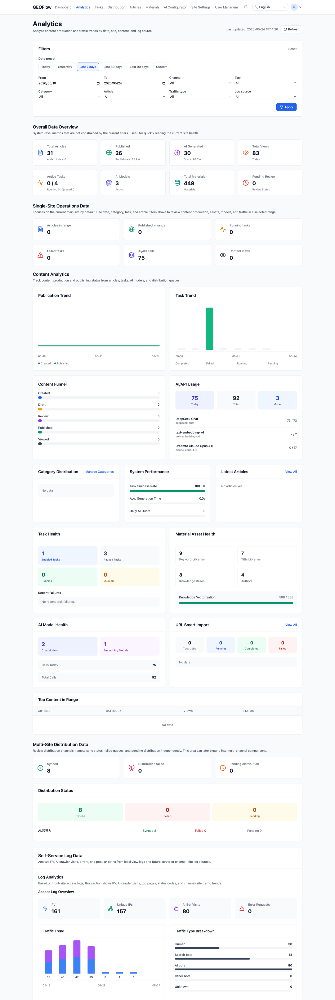
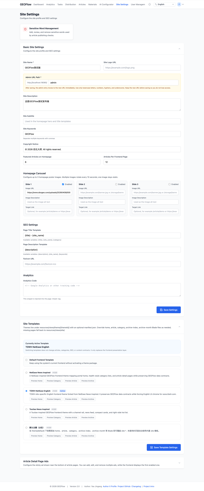
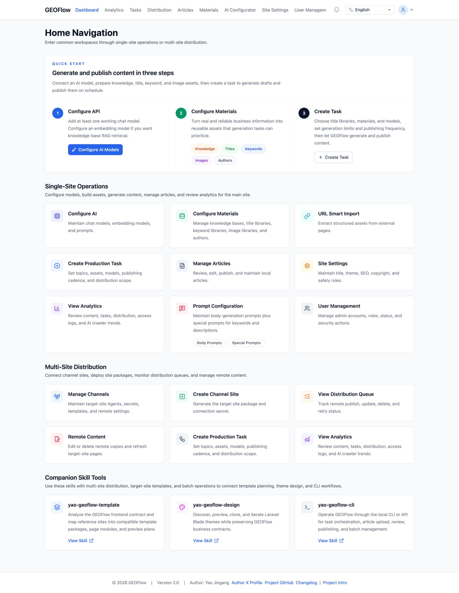
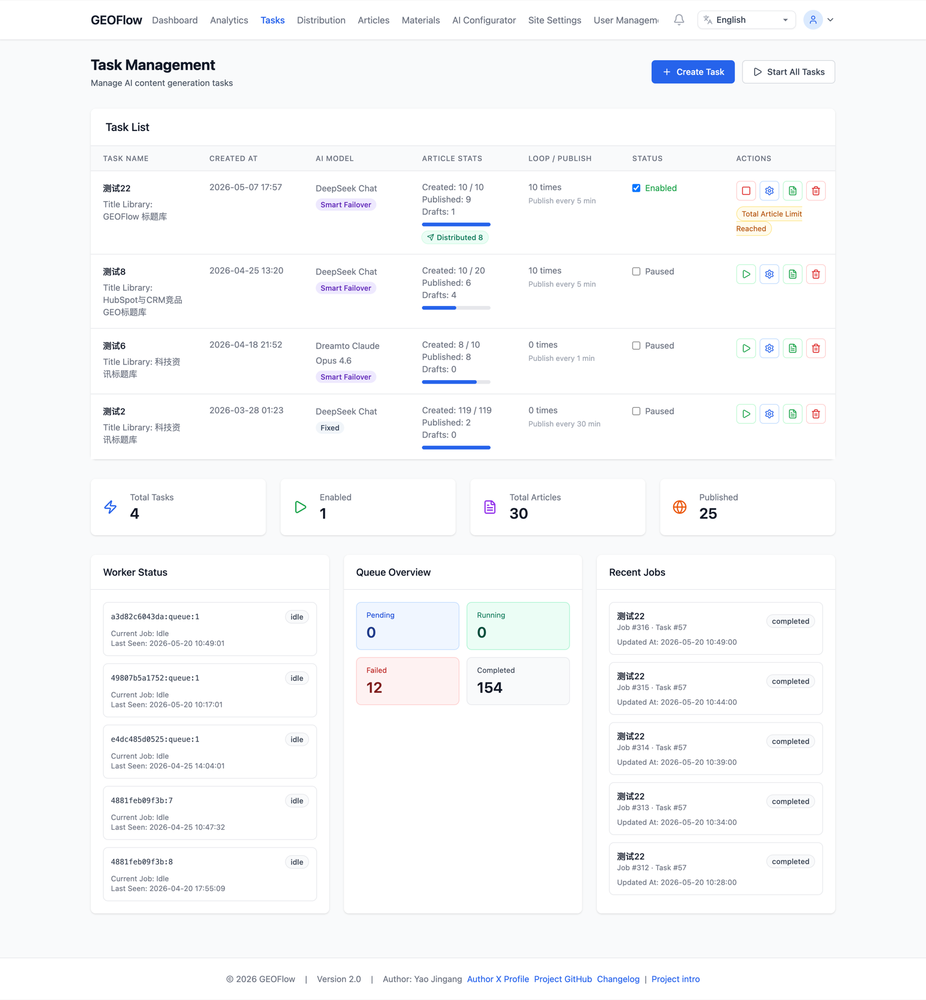
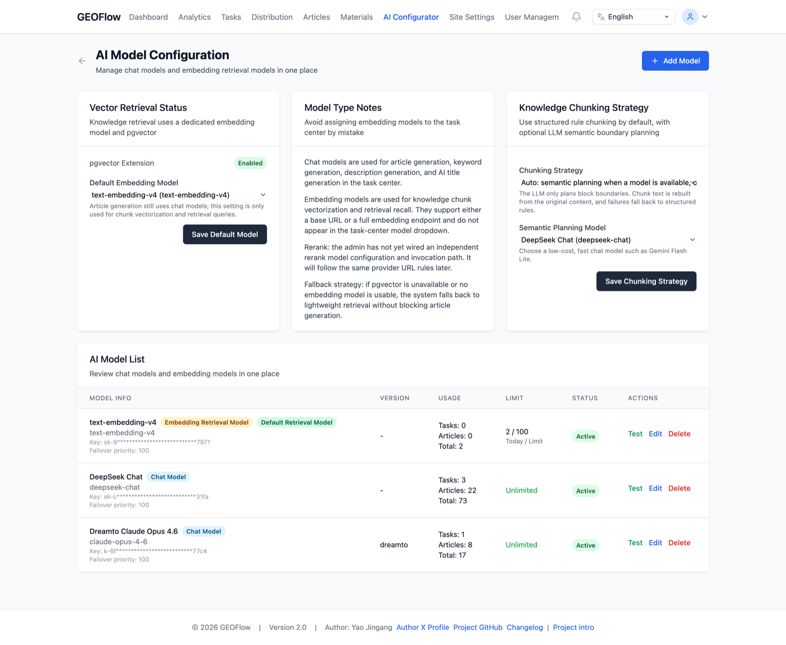
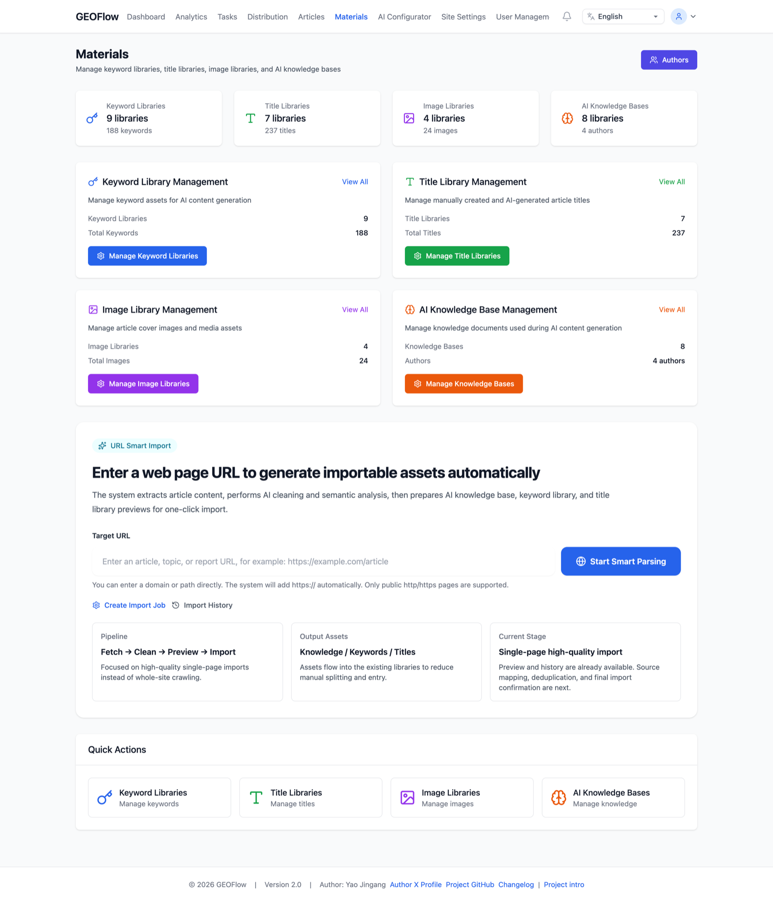

# GEOFlow

> Languages: [简体中文](../../README.md) | [English](README_en.md) | [日本語](README_ja.md) | [Español](README_es.md) | [Русский](README_ru.md) | [Português (BR)](README_pt_BR.md)

> GEOFlow — открытая система контент-инжиниринга GEO (Generative Engine Optimization) и мультисайтовой дистрибуции. Она объединяет базы знаний, библиотеки материалов, промпты, AI-задачи, ревью и публикацию, аналитику, пакеты целевых сайтов GEOFlow Agent, каналы WordPress REST, универсальные HTTP API-каналы и удалённую статическую публикацию в единый управляемый поток, который превращает достоверные материалы в публикуемые, отслеживаемые и распределяемые GEO-активы.

[](https://www.php.net/)
[](https://www.postgresql.org/)
[](https://docs.docker.com/compose/)
[](../../LICENSE)
[](https://github.com/yaojingang/GEOFlow/stargazers)
[](https://github.com/yaojingang/GEOFlow/network/members)
[](https://github.com/yaojingang/GEOFlow/issues)

GEOFlow распространяется по лицензии [Apache License 2.0](../../LICENSE). Его можно использовать, копировать, изменять и распространять, в том числе в коммерческих целях, при условии сохранения уведомлений об авторских правах и лицензии, а также соблюдения условий Apache-2.0 о патентах, товарных знаках и отказе от гарантий.

---

## ✨ Возможности

| Возможность | Описание |
|-------------|----------|
| 🤖 Несколько моделей | API в стиле OpenAI и нативные endpoints Gemini, chat / embedding, адаптация URL провайдера, smart failover, повторы и статистика вызовов |
| 🧠 RAG по базе знаний | Структурное rule chunking, опциональное LLM semantic planning, стабильный fallback, запись векторов при наличии embedding-модели и поиск контекста при генерации |
| 🗂 Материалы и промпты | Заголовки, ключевые слова, изображения, авторы, базы знаний, промпты тела и специальные промпты |
| 📦 Автоматизация задач | Лимиты генерации, пул черновиков, ревью, частота публикации, очереди, повторы, область публикации и фильтры статей по задаче |
| 📋 Ревью и статьи | Черновики, ревью, публикация, корзина, авторы, категории, SEO и источник задачи в одном процессе |
| 📡 Мультисайтовая дистрибуция | Каналы GEOFlow Agent, WordPress REST и универсального HTTP API, секреты, пакеты целевых сайтов, статический режим, rewrite-правила, удалённое редактирование/удаление, очереди и логи |
| 🧾 Пакеты целевого сайта | PHP Agent для каждого канала: главная, страницы статей, статические assets, sitemap, `llms.txt` / TXT-карты и Schema |
| 📊 Аналитика | Обзор системы, одиночный сайт, мультисайтовая дистрибуция, access logs, топ-контент, AI-краулеры и тренды |
| 🔍 SEO и LLM-friendly вывод | SEO, Open Graph, Schema, GFM Markdown, отдельный CSS, синхронизация изображений, sitemap и TXT-карты |
| 🎨 Фронт и темы | Темы, preview, переключение в админке и синхронизация удалённых заголовков, copyright, тем и категорий |
| 🌍 i18n админки | Китайский, английский, японский, испанский, русский и португальский (Бразилия), включая модули Admin UI V3 |
| 🔔 Уведомления о версии | Проверка GitHub `version.json` и уведомления о новой версии |
| 🐳 Готовый Docker | **Compose**: Postgres (pgvector), Redis, приложение, очередь, scheduler, Reverb и production Nginx/php-fpm |

---

## GEOFlow CLI 0.2.0

В репозитории есть `bin/geoflow` для работы с каталогами, задачами, заданиями, материалами и статьями через API v1. Официально поддерживаются macOS, Linux и WSL. В нативной Windows необходимо вручную проверить ACL файла конфигурации.

[Полное руководство по CLI на английском](../GEOFLOW_CLI_en.md)

---

## 🖼 Предпросмотр UI

<table>
  <tr>
    <td width="34%" rowspan="3"><br /><sub>Analytics</sub></td>
    <td width="33%" rowspan="2"><br /><sub>Site Settings</sub></td>
    <td width="33%"><br /><sub>Admin Dashboard</sub></td>
  </tr>
  <tr>
    <td width="33%"><br /><sub>Task Management</sub></td>
  </tr>
  <tr>
    <td width="33%"><br /><sub>AI Model Configuration</sub></td>
    <td width="33%"><br /><sub>Materials</sub></td>
  </tr>
</table>

Охватывает админ-панель, аналитику, задачи, материалы, модели и настройки сайта.

---

## 🆕 Что важно в новой версии

GEOFlow 3.0 заметно обновляет админку, ИИ, дистрибуцию и операционные процессы:

- **Admin UI V3 объединяет интерфейс**: страницы используют общую боковую панель, верхнюю панель, навигацию и шаблоны взаимодействия. Добавлены недавние действия, изменение ширины панели, адаптивная вёрстка, доступные состояния и локальные ресурсы.
- **AI Workspace стал иллюстрированным помощником админки**: системная база охватывает 15 тем и включает 24 обезличенных снимка экрана и 72 фиксированных проверочных вопроса. Ответы передаются через SSE, а ссылки учитывают права текущего администратора. Прежний процесс Run, Plan, Approval, Capability и Trace больше не принимает новые запросы, а исторические данные сохраняются.
- **ИИ-проверка качества стала шлюзом публикации**: она оценивает доказательства, рекламные правила и контекст, возвращает баллы, позиции в тексте, правовые ссылки, рекомендации и аудируемое разрешение. Длинные статьи продолжаются по сегментам очереди.
- **У размещённых сайтов каналов появился полный жизненный цикл**: доступны назначение поддоменов, управление состояниями, привязка статей, квоты, паузы после сбоев, техническая проверка, сброс кэша и сверка состояния с защитой границ основного хоста и доверенных прокси.
- **Ручная публикация связана с помощником операций Chrome**: расширение использует привязку устройства и токены с минимальными правами для получения заданий, heartbeat, проверки аккаунта, заполнения текстовых черновиков ответов Zhihu и возврата подтверждений. Финальную публикацию подтверждает пользователь.
- **Админку можно установить как PWA**: локальные значки, манифест, Service Worker и обновления создают отдельное рабочее окно.
- **Настройка задач и моделей стала безопаснее**: перед запуском проверяются ёмкость библиотеки заголовков и конфликты, а тесты моделей фиксируют реальный streaming, текстовый fallback, переключение при сбоях и состояние готовности.
- **Длительные операции с контентом поддерживают восстановление**: библиотеки генерируют до 100 000 заголовков пакетами, корзина задач хранит аудит 90 дней, а выбранные статьи экспортируются в Markdown ZIP.
- **API и CLI покрывают повседневные операции**: API v1 и `bin/geoflow` работают с каталогами, задачами, запусками, материалами, статьями и браузерными операциями через структурированные данные и проверки безопасности.
- **Независимый updater выполняет рискованные операции**: локальный Unix socket API запускает обновления, полные резервные копии, проверку среды и восстановление. Совместимый подписанный выпуск привязывается к финальному коммиту и digest образов GEOFlow 3.0.
- **Уточнены правила установки и развёртывания**: новая установка создаёт только необходимые данные и не импортирует демонстрационные статьи. Обновление запускает миграции, пересобирает frontend и перезапускает процессы; размещённые сайты включаются после настройки wildcard DNS, wildcard TLS, доверенных прокси и Nginx.

---

## 🏗 Схема выполнения

```
Админка
  ↓
AI-настройки / материалы / промпты / задачи
  ↓
Планировщик / очередь / worker запускает AI-генерацию
  ↓
Черновик / ревью / публикация
  ↓
Локальные статьи и SEO-страницы
  ↓
Очередь дистрибуции / Agent целевого сайта
  ↓
Удалённая главная, статьи, sitemap, TXT-карты и llms.txt
```

---

## 🧱 Архитектура

| Уровень | Описание |
|---------|----------|
| Web / Admin | **Laravel**: маршруты, контроллеры, сайт статей, **Blade** admin, аналитика, дистрибуция, материалы и задачи |
| API / Agent | Локальные API и PHP Agent целевых сайтов для health check, приёма/обновления/удаления статей, синхронизации настроек и генерации статических файлов |
| Scheduler / Queue / Reverb | **Scheduler**, **`queue:work` / Horizon** для генерации и дистрибуции, при необходимости **Reverb** |
| Домен и Jobs | `app/Services`, `app/Jobs`, `app/Http/Controllers` для AI, RAG, публикации, дистрибуции и анализа логов |
| Хранение | **PostgreSQL** (рекомендуется **pgvector**) + **Redis** + JSON/статические файлы на целевых сайтах |

Основной поток: настройка моделей и промптов → подготовка базы знаний, заголовков, ключевых слов, изображений и авторов → задачи в очередь → генерация воркерами → черновик / ревью / публикация → локальные SEO-страницы → дистрибуция в выбранные каналы → аналитика производства, дистрибуции, доступа и AI-краулеров.

---

## ⚡ Быстрый старт в админке

1. **Настройте API**: добавьте минимум одну chat-модель; для RAG добавьте embedding-модель и выберите стратегию chunking.
2. **Настройте материалы**: подготовьте базу знаний, заголовки, ключевые слова, изображения и авторов на основе реальной проверяемой информации.
3. **Создайте задачу**: выберите материалы, модель, объем генерации, частоту и область публикации; сначала проверьте поток через черновики или ревью.

---

## 🎯 Сценарии использования и ожидаемая польза

GEOFlow подходит для таких практических сценариев:

- **Независимый GEO-сайт**
  Для публикации FAQ, продуктовых материалов, кейсов и брендового знания на отдельном сайте. Цель — повысить видимость в AI-поиске и эффективность контент-операций, а не штамповать низкокачественные страницы.
- **GEO-подканал внутри основного сайта**
  Для запуска отдельного новостного, экспертного или knowledge-раздела внутри уже существующего сайта. Цель — лучше структурировать контент и упростить его поддержку.
- **Независимый GEO-источник**
  Для системного накопления гайдов, рейтингов, аналитики и разборов по конкретной теме или отрасли. Цель — строить доверенный контентный актив, а не загрязнять интернет шумом.
- **Внутренняя GEO CMS / операционная система контента**
  Для использования GEOFlow как внутреннего backend-инструмента для моделей, материалов, знаний, промптов, ревью и публикации. Цель — повысить эффективность команды.
- **Мультисайтовое или мультиканальное GEO-развертывание**
  Для управления несколькими сайтами, каналами или темами по единому процессу. Цель — стандартизация и повторяемость работы.
- **Автоматизированное управление источниками и дистрибуция**
  Для инженерного подхода к базам знаний, тематическим обновлениям и контролируемой дистрибуции. Цель — чтобы полезная информация оставалась структурированной, проверяемой и находимой.

Польза от системы возможна только при наличии **реальной, качественной и поддерживаемой базы знаний**.
GEOFlow не предназначен для создания ложного контента или массового информационного шума. Его задача — повышать эффективность AI-маркетинга и GEO-операций за счет работы с доверенным контентом.

---

## 🧭 Рекомендуемые способы развертывания и использования

- **Как самостоятельный GEO-сайт**
  Разворачивайте полный frontend и admin и используйте систему как отдельную контентную площадку.
- **Как GEO-подканал существующего сайта**
  Используйте GEOFlow в поддомене, каталоге или отдельном канале без полной переделки основного сайта.
- **Как GEO-сайт-источник**
  Сначала стройте базу знаний, затем подключайте задачи и автоматизацию для стабильных обновлений.
- **Как внутреннюю систему управления GEO-контентом**
  Делайте акцент на админке, моделях, библиотеках материалов, API и редакционных процессах.
- **Как мультисайтовую платформу**
  Используйте общие процессы и шаблоны для нескольких брендов, тематик или экспериментальных площадок.
- **Как систему автоматизированного управления источниками**
  Рассматривайте библиотеки заголовков, изображений и промптов, а также базу знаний, как долгосрочную инфраструктуру.

Рекомендуемый порядок работы:

1. Сначала определить реальную бизнес-задачу и аудиторию
2. Сначала построить базу знаний
3. Обеспечить точность, проверяемость и поддерживаемость контента
4. Только затем усиливать систему автоматизацией

Если база знаний слабая, автоматизация лишь масштабирует шум. В GEOFlow **качество базы знаний должно быть на первом месте**.

---

## 🚀 Быстрый старт

### Вариант 1: Docker (разработка / демо)

```bash
git clone https://github.com/yaojingang/GEOFlow.git
cd GEOFlow
cp .env.example .env
vi .env

docker compose build
docker compose up -d
```

- Сайт: `http://localhost:18080` (порт **`APP_PORT`**, по умолчанию `18080`)
- Админка: `http://localhost:18080/geo_admin/login` (**`ADMIN_BASE_PATH`**, по умолчанию `geo_admin`)

При **`docker-compose.yml`** сервис **`init`** после готовности БД выполняет миграцию и `php artisan geoflow:install`; начальные данные записываются только для пустой базы (учётная запись по умолчанию — см. таблицу ниже).

### Дополнение: Docker (продакшен)

Для продакшена используйте **`docker-compose.prod.yml`** с **Nginx + php-fpm**, а не `php artisan serve`.

```bash
cp .env.prod.example .env.prod
vi .env.prod

docker compose --env-file .env.prod -f docker-compose.prod.yml build
docker compose --env-file .env.prod -f docker-compose.prod.yml up -d postgres redis
docker compose --env-file .env.prod -f docker-compose.prod.yml up -d init
docker compose --env-file .env.prod -f docker-compose.prod.yml up -d app web queue scheduler reverb
```

- Фронт и админка идут через `web` (Nginx), PHP — контейнер `app` (php-fpm).
- **Первая установка:** production-сервис `init` запускает миграции, а затем `php artisan geoflow:install`. Эта последовательность предназначена для пустой базы. Для экземпляров с данными или историей миграций обязателен протокол остановки и дренирования из раздела 3.1 `../../docs/deployment/DEPLOYMENT.md`.
- Подробности — в **`../../docs/deployment/DEPLOYMENT.md`**.

### Вариант 2: локальный PHP

**Требования:** PHP **8.3+** (`pdo_pgsql`, `redis` и др.), **PostgreSQL**, **Redis**, **Composer 2.x**.

```bash
git clone https://github.com/yaojingang/GEOFlow.git
cd GEOFlow
cp .env.example .env
composer install --no-interaction --prefer-dist
php artisan key:generate

GEOFLOW_SECURITY_FRESH_INSTALL_CONFIRMED=true php artisan migrate --force
php artisan geoflow:install
php artisan storage:link

php artisan serve --host=127.0.0.1 --port=8080
```

Дополнительные терминалы:

```bash
php artisan queue:work redis --queue=geoflow,distribution,default --sleep=1 --tries=1 --timeout=300
php artisan schedule:work
php artisan reverb:start
```

Админка: `http://127.0.0.1:8080/geo_admin/login`. **Продакшен:** Nginx + PHP-FPM, корень **`public/`**.

---

## Учётные данные по умолчанию (после `geoflow:install`)

| Поле | Значение |
|------|----------|
| Логин | `GEOFLOW_ADMIN_USERNAME`, по умолчанию `admin` |
| Пароль | В локальной разработке по умолчанию `password`; в продакшене задайте `GEOFLOW_ADMIN_PASSWORD`. Если значение пустое и аккаунт ещё не существует, установщик сгенерирует одноразовый случайный пароль в логах init / `geoflow:install`. |

`geoflow:install` запускает начальные seeders только на пустой базе. Если он обнаружит пользовательские или бизнес-данные, то только запишет маркер установки и пропустит seed. Admin seeder остаётся идемпотентным и не перезаписывает существующий логин, email или пароль.

Обычная установка и команда `db:seed` не запускают `FrontendDemoSeeder`. Демо-данные разрешены только в тестах, которые вызывают этот seeder явно. Во всех развернутых средах сохраняйте `GEOFLOW_SEED_FRONTEND_DEMO=false` и `GEOFLOW_SEED_FRONTEND_DEMO_OVERWRITE=false`.

### Блокировка после неудачных входов и ручная разблокировка

- Аккаунт администратора автоматически блокируется (`status=locked`) после **5** подряд неудачных попыток входа.
- Заблокированный аккаунт не сможет войти, пока администратор не выполнит ручную разблокировку.
- Команда разблокировки:

```bash
php artisan geoflow:admin-unlock USERNAME
```

Пример:

```bash
php artisan geoflow:admin-unlock admin
```

---

## Docker (кратко)

**Разработка** (`docker-compose.yml`): `web` публикует единый шлюз Nginx на `127.0.0.1:${APP_PORT:-18080}:80`; `app` и `reverb` остаются во внутренней сети, а WebSocket доступен по тому же источнику через `/reverb`. В стек также входят `postgres`, `redis`, `assets`, `init`, `queue` и `scheduler`. Переменные `docker/entrypoint.sh` описаны в [README_en.md](README_en.md).

**Продакшен** (`docker-compose.prod.yml`): запуск через `docker compose --env-file .env.prod -f docker-compose.prod.yml …` (см. дополнение выше и **`../../docs/deployment/DEPLOYMENT.md`**).

---

## Разработка и тесты

```bash
composer test
./vendor/bin/pint
```

---

## 🌍 Другие языки

- [简体中文](../../README.md)
- [English](README_en.md)
- [日本語](README_ja.md)
- [Español](README_es.md)

---

## 📄 Лицензия

GEOFlow распространяется по [Apache License 2.0](../../LICENSE). Лицензия разрешает личное и коммерческое использование, изменение, распространение и приватное развертывание при соблюдении уведомлений о лицензии, авторских правах, изменениях, патентных условиях и отказе от гарантий.

---

## ⭐ Динамика звёзд

[](https://star-history.com/#yaojingang/GEOFlow&Date)
