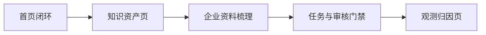

# GEOFlow 内容工程演示后台轻量改造计划

## 背景

本计划基于两份本地材料：

- `/Users/laoyao/Documents/GEO 内容工程操作手册与评估标准.docx`
- `/Users/laoyao/Documents/GEO 内容工程系统研究报告.docx`

两份材料的共同结论是：GEO 内容工程不是批量写文章，也不是单点 SEO 技巧，而是把用户问题、品牌事实、证据、结构化内容、发布分发、观测归因和治理流程组织成一个可运行、可验证、可维护的系统。

GEOFlow 已经具备这个系统的大部分零件：AI 模型、知识库、企业资料梳理、提示词、任务、文章审核、分发管理、访问分析和 AI 爬虫识别。当前短板不是能力缺失，而是后台叙事仍偏“自动内容生产系统”，听众需要自己把它翻译成“内容工程闭环”。

因此，本次改造的目标是轻量重组后台表达，让 GEOFlow 成为今晚分享中可直接演示的 GEO 内容工程系统。

## 一句话定位

把 GEOFlow 后台从“AI 内容生成与分发后台”显性调整为“GEO 内容工程工作台”：先建设知识资产，再围绕问题图谱生成结构化内容，经过审核和分发后，用观测数据持续迭代。

## 目标

1. 让首页一屏解释清楚 GEO 内容工程闭环。
2. 让素材管理页说明“资料如何变成知识资产和证据库”。
3. 让企业资料梳理功能成为“知识原子化”的演示入口。
4. 让任务创建页表达“内容工程 Sprint”，而不是单纯生成文章。
5. 让文章审核页具备发布前 GEO 质量门禁的提示。
6. 让数据分析页表达观测、归因和治理闭环。
7. 全部改造尽量复用现有表、控制器和统计数据，避免为了演示新增复杂数据模型。

## 非目标

- 本阶段不接入 ChatGPT、Perplexity、Google AI Overviews、Gemini 等真实外部 AI 搜索测量。
- 本阶段不做自动 Citation Selection 和 Citation Absorption 评估。
- 本阶段不新建完整 Prompt Universe 数据库。
- 本阶段不新建实体图谱系统。
- 本阶段不承诺任何搜索或 AI 平台排名效果。
- 本阶段不改动前台主题系统和多站点分发协议。
- 本阶段不做大规模数据库迁移。

## 设计原则

1. **演示优先**：优先让听众理解内容工程逻辑，而不是追求功能完整度。
2. **复用优先**：复用现有后台模块，少做新表和新控制器。
3. **白帽表达**：所有文案都强调真实资料、证据、结构、审核和复盘，不讲操纵模型。
4. **可回滚**：第一轮主要是 Blade 视图和语言包文案改造，回滚成本低。
5. **可继续产品化**：页面结构要为后续 GEO 评分卡、Prompt 面板和 AI 引用监控预留叙事位置。

## 核心映射

| 材料中的内容工程模块 | GEOFlow 现有能力 | 本次改造后的演示说法 |
| --- | --- | --- |
| GEO 目标与边界 | 后台首页、欢迎说明、站点设置 | 定义要优化的问题、人群、站点和风险边界 |
| Prompt Graph / 问题地图 | 标题库、关键词库、提示词、任务标题 | 把关键词扩展为用户会问的问题集合 |
| Knowledge Assets / 知识资产 | 知识库、企业资料梳理、URL 采集 | 把资料沉淀成可召回、可审核、可复用的知识资产 |
| Evidence / 证据与溯源 | 知识库元数据、风险等级、审核状态、资料时间 | 每个主张都带来源、时间、业务线和风险标记 |
| Structure / 内容结构 | 提示词、文章编辑、Markdown、SEO 字段 | 把内容做成 AI 和人都能抽取的结构化页面 |
| Production / 生产编排 | 任务中心、队列、AI 模型、草稿池 | 一次内容工程 Sprint，控制输入、模型、节奏和范围 |
| Review / 治理 | 文章审核、敏感词、安全设置、活动日志 | 发布前检查事实、证据、结构和风险 |
| Authority Network / 权威网络 | 分发渠道、GEOFlow Agent、WordPress、通用 API | 把同一事实分发到多个可信出口，形成一致信源 |
| Measurement / 观测归因 | 数据分析、访问日志、AI 爬虫识别、分发队列 | 用任务、分发、访问和 AI 爬虫数据反向修正内容 |

## 推荐执行范围

本次建议执行一个轻量版本，分 5 个可独立合并的阶段。每个阶段完成后系统都保持可用，后续阶段未完成也不影响已上线部分。



## Phase 1：首页改成内容工程闭环

### 目标

打开后台首页时，听众能在 30 秒内理解 GEOFlow 的内容工程链路。

### 改动文件

- `resources/views/admin/dashboard.blade.php`
- `lang/zh_CN/admin.php`
- `lang/en/admin.php`

### 具体改动

1. 将首页主标题从“首页导航”调整为偏内容工程表达，比如“GEO 内容工程工作台”。
2. 将快速开始三步调整为：
   - 建设可信知识资产。
   - 设计问题图谱与生成任务。
   - 审核、分发并复盘观测数据。
3. 将自动化流水线节点改为 7 个内容工程节点：
   - 问题地图。
   - 知识资产。
   - 证据结构。
   - 任务生产。
   - 审核发布。
   - 权威分发。
   - 观测归因。
4. 保留现有统计口径，不新增查询。
5. 在当前建议动作中加入内容工程解释，比如未向量化切片会影响证据召回质量，待审核文章会影响发布门禁。

### 验收标准

- 首页不再只像运营导航，而是能明确表达内容工程闭环。
- 原有模型、素材、任务、分发、分析入口全部保留。
- 页面在桌面和移动端不出现明显文本溢出。
- 首页无需数据库迁移即可渲染。

## Phase 2：素材管理改成知识资产与证据库

### 目标

让“素材管理”成为解释“内容从资料变成知识基础设施”的核心页面。

### 改动文件

- `resources/views/admin/materials/index.blade.php`
- `app/Http/Controllers/Admin/MaterialsController.php`
- `lang/zh_CN/admin.php`
- `lang/en/admin.php`

### 具体改动

1. 将“AI 知识库中枢”调整为“知识资产与证据库”。
2. 将知识流程文案调整为：
   - 资料入库。
   - 知识原子化。
   - 证据元数据。
   - 切片向量化。
   - 任务召回。
   - 内容生成。
3. 保留现有知识库数量、切片数量、向量化进度、元数据完整数、审核数和高风险待审数。
4. 增加一个轻量解释区，说明知识库元数据如何支撑混合召回、证据引用、冲突判断和治理。
5. 将企业资料梳理入口文案调整为“生成可校对的知识原子草稿”。

### 验收标准

- 素材管理页能清楚说明知识资产、证据、切片和召回之间的关系。
- 统计数据继续来自现有 `MaterialsController`。
- 不新增素材类型，不改动知识库导入保存逻辑。

## Phase 3：企业资料梳理改成知识原子化入口

### 目标

现场可以上传或粘贴一份企业资料，演示它如何先变成可校对知识稿，再发布为正式知识库。

### 改动文件

- `resources/views/admin/enterprise-knowledge/create.blade.php`
- `resources/views/admin/enterprise-knowledge/index.blade.php`
- `resources/views/admin/enterprise-knowledge/show.blade.php`
- `app/Services/GeoFlow/EnterpriseKnowledgeDraftService.php`
- `lang/zh_CN/admin.php`
- `lang/en/admin.php`

### 具体改动

1. 将页面文案从“企业资料梳理”强化为“知识原子化”。
2. 将流程节点调整为：
   - 收集资料。
   - 提取事实。
   - 组织知识原子。
   - 标注风险与待确认项。
   - 发布到正式知识库。
3. 在草稿校验结果中强化三个提示：
   - 缺失章节。
   - 绝对化或风险表述。
   - 待补充证据。
4. 保留当前 REQUIRED_SECTIONS，不改变 AI 输出结构，避免影响已有测试和用户习惯。
5. 在页面说明中引入材料里的关键概念：主张、上下文、实体归属、证据、时间、责任人。

### 验收标准

- 企业资料梳理页可以作为“资料变知识原子”的演示页。
- 原有上传、排队、草稿编辑、自动保存、校验、版本、发布知识库流程不受影响。
- AI 不可用时，回退草稿仍能解释为“稳定整理模板”。

## Phase 4：任务创建和文章审核增加 GEO 质量门禁提示

### 目标

让任务创建和文章审核表达“内容工程 Sprint”和“发布前质量门禁”，不是简单批量生成。

### 改动文件

- `resources/views/admin/tasks/create.blade.php`
- `resources/views/admin/articles/index.blade.php`
- `resources/views/admin/articles/form.blade.php`
- `lang/zh_CN/admin.php`
- `lang/en/admin.php`

### 具体改动

1. 在任务创建页顶部增加内容工程 Sprint 提示：
   - 输入：问题图谱、标题库、知识库、提示词、模型、图片和作者。
   - 处理：召回证据、生成草稿、进入审核。
   - 输出：结构化文章、本地发布、多站点分发和观测数据。
2. 在知识库选择区域补充说明：最多选择 5 个知识库，代表本次任务的证据范围。
3. 在发布和审核区域补充说明：建议演示时默认开启审核，因为 GEO 内容工程强调事实校验和风险控制。
4. 在文章表单或文章列表中增加轻量发布前检查提示：
   - 是否有摘要块。
   - 是否有证据或来源。
   - 是否有 FAQ、步骤、对比或边界条件。
   - 是否避免绝对化承诺。
5. 本阶段只做提示和检查清单，不阻断保存或发布。

### 验收标准

- 任务创建页能解释清楚一次任务如何对应一次内容工程 Sprint。
- 文章管理页能解释发布前为什么要审核。
- 不改变任务创建字段和文章保存字段。

## Phase 5：数据分析页改成观测与归因层

### 目标

把现有数据分析页解释成内容工程闭环里的“观测、归因、治理”层。

### 改动文件

- `resources/views/admin/analytics/index.blade.php`
- `resources/views/admin/analytics/_global-overview.blade.php`
- `resources/views/admin/analytics/_single-site-section.blade.php`
- `resources/views/admin/analytics/_distribution-section.blade.php`
- `resources/views/admin/analytics/_log-section.blade.php`
- `lang/zh_CN/admin.php`
- `lang/en/admin.php`

### 具体改动

1. 将分析页副标题调整为“用生产、分发、访问和 AI 爬虫数据复盘内容工程效果”。
2. 在全局概览中说明指标分层：
   - 工程产出：文章、任务、素材、模型调用。
   - 发布表现：发布率、审核状态、分发状态。
   - 访问观测：PV、热门页面、访问路径。
   - AI 线索：AI 爬虫和代理访问。
   - 风险治理：失败任务、失败分发、异常请求。
3. 将 AI 爬虫统计解释为“外部 AI 或搜索系统可能正在抓取内容的观测信号”，避免误说成真实 AI 引用。
4. 在日志区增加边界说明：本站日志不能替代真实 AI 搜索引用监测，但可以作为观测层的一部分。

### 验收标准

- 分析页能清楚区分“站内观测”和“外部 AI 引用测量”。
- 现有图表和表格继续可用。
- 不接入任何外部账号或 API。

## 推荐不做的方案

### 不建议第一轮做真实 AI 搜索监控

真实 AI 搜索监控需要解决账号、地区、引擎差异、重复采样、截图或 HTML 存档、引用 URL 抽取、答案句子对齐和归因统计。这个方向对，但第一轮会拖慢演示改造，也会让今晚分享的重点从“内容工程逻辑”偏到“监测工具建设”。

### 不建议第一轮新增 GEO 评分数据库表

材料里的 `GEO-CE Score` 很适合产品化，但第一版可以先以发布前检查清单和页面说明呈现。等后台叙事跑通后，再决定是否新增 `geo_quality_audits` 一类表来保存评分结果。

## 后续产品化候选

这些不纳入本次确认后的第一轮实现，但可以作为第二轮计划：

1. **规则版 GEO-CE Score**：对文章或知识库做静态 100 分评分，覆盖意图、证据、结构、归因、治理和观测记录。
2. **Prompt Universe 面板**：管理目标 Prompt、用户角色、场景约束、目标页面和测量频率。
3. **Live Engine 测量记录**：手动或半自动记录 ChatGPT、Perplexity、Gemini、Google AI Overviews 等平台的引用和答案表现。
4. **Citation Absorption 审计**：人工或 LLM 辅助把答案句子对齐到页面证据片段。
5. **内容资产卡**：给高价值页面绑定 owner、更新 SLA、目标问题、证据等级和版本记录。

## 实施风险

| 风险 | 影响 | 控制方式 |
| --- | --- | --- |
| 文案变多导致页面拥挤 | 后台变得像说明书 | 用短文案、折叠说明和状态卡控制密度 |
| 过度强调 AI 爬虫 | 用户误以为等同于 AI 引用 | 明确标注为抓取观测信号，不等同于答案引用 |
| 改动语言包范围较大 | 多语言 key 容易漏 | 优先补齐中文和英文，运行相关页面测试 |
| 首页节点改名影响用户习惯 | 老用户找入口变慢 | 保留图标、按钮和路由，改文案不改导航位置 |
| 企业资料梳理文案改太重 | 影响原有使用理解 | 不改 REQUIRED_SECTIONS，只改解释层 |

## 验证计划

### 自动化测试

执行最小相关测试：

```bash
php artisan test --compact tests/Feature/AdminDashboardQuickStartTest.php
php artisan test --compact tests/Feature/AdminMaterialsPagesTest.php
php artisan test --compact tests/Feature/AdminAnalyticsPageTest.php
php artisan test --compact tests/Feature/AdminArticlesPageTest.php
php artisan test --compact tests/Feature/AdminTasksPageTest.php
php artisan test --compact tests/Feature/AdminEnterpriseKnowledgeTest.php
```

如果改动只涉及 Blade 和语言包，测试重点是页面可渲染、关键文案存在、路由入口不丢失。

### 格式化

如果实施时改动 PHP 文件，执行：

```bash
vendor/bin/pint --dirty --format agent
```

如果只改 Blade 和语言包，仍需运行对应 Feature 测试。

### 手工验收

1. 登录后台首页，确认首屏能讲清内容工程闭环。
2. 进入素材管理，确认知识资产、证据元数据、切片向量化、任务召回之间的关系清楚。
3. 进入企业资料梳理，确认上传资料到草稿、校验、发布知识库的演示路径顺畅。
4. 进入任务创建，确认任务被解释为内容工程 Sprint。
5. 进入文章管理，确认发布前质量门禁说明存在且不阻断保存。
6. 进入数据分析，确认站内观测和外部 AI 引用边界表达清楚。
7. 切换英文后台，确认页面不会出现明显缺失 key。

## 回滚策略

本阶段主要改动 Blade 视图和语言包，回滚方式是还原以下文件：

- `resources/views/admin/dashboard.blade.php`
- `resources/views/admin/materials/index.blade.php`
- `resources/views/admin/enterprise-knowledge/create.blade.php`
- `resources/views/admin/enterprise-knowledge/index.blade.php`
- `resources/views/admin/enterprise-knowledge/show.blade.php`
- `resources/views/admin/tasks/create.blade.php`
- `resources/views/admin/articles/index.blade.php`
- `resources/views/admin/articles/form.blade.php`
- `resources/views/admin/analytics/*.blade.php`
- `lang/zh_CN/admin.php`
- `lang/en/admin.php`

如果实施过程中发现某个页面已有未预期改动，只回滚本次修改的片段，不覆盖用户已有修改。

## 确认后执行顺序

1. 实施 Phase 1：首页闭环。
2. 实施 Phase 2：素材管理知识资产页。
3. 实施 Phase 3：企业资料梳理知识原子化入口。
4. 实施 Phase 4：任务与文章审核质量门禁提示。
5. 实施 Phase 5：数据分析观测归因层。
6. 运行相关测试和必要的格式化。
7. 汇总改动、测试结果和未纳入范围。

## 当前建议

建议确认后先执行 Phase 1 到 Phase 5 的轻量改造，不新增表，不接外部服务，不改核心生成和分发逻辑。这样可以最快把 GEOFlow 变成今晚分享可讲、可演示、可理解的 GEO 内容工程系统，同时保留后续产品化空间。
